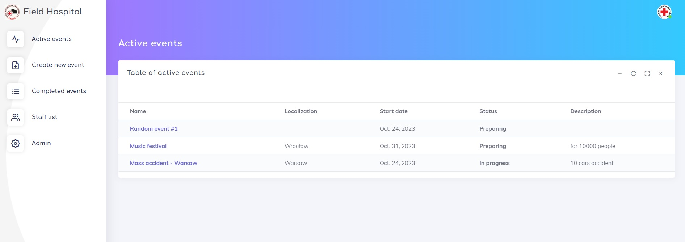
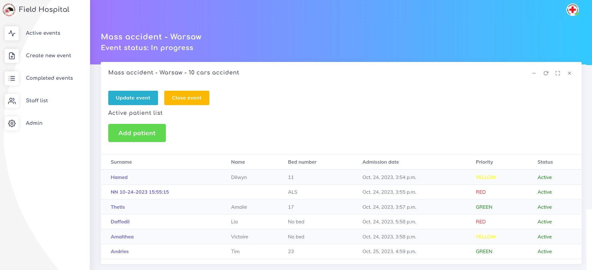
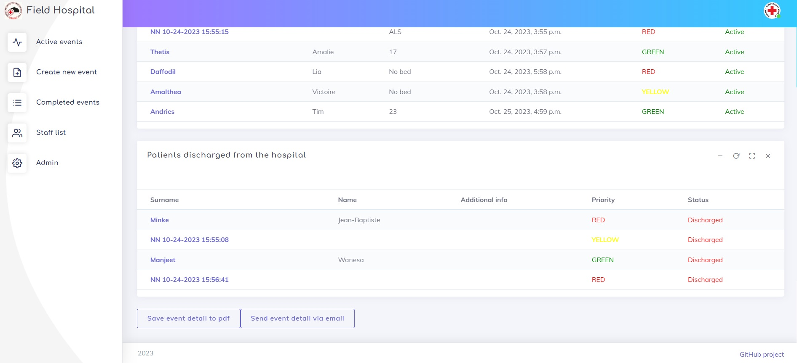
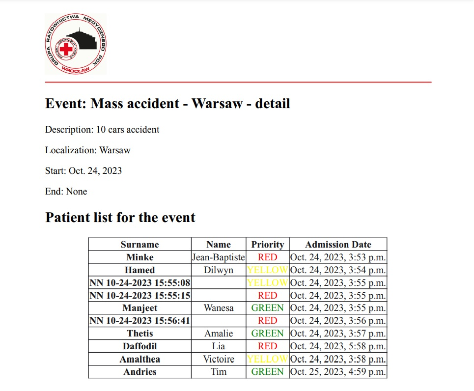
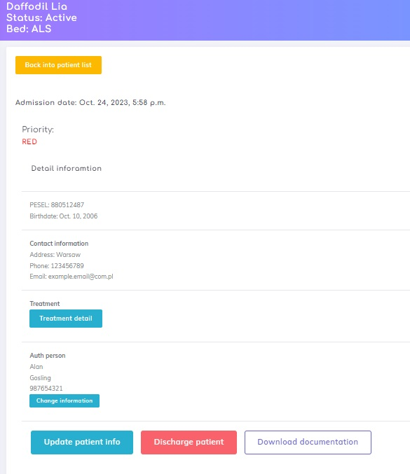
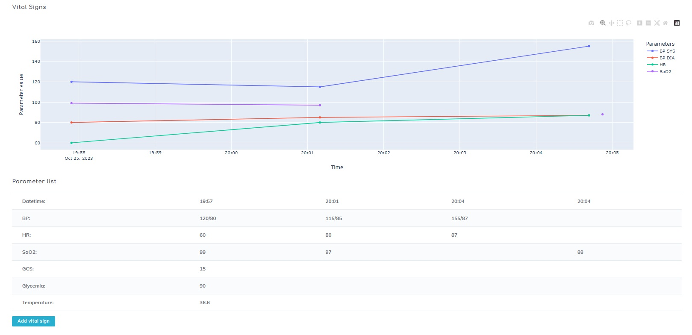
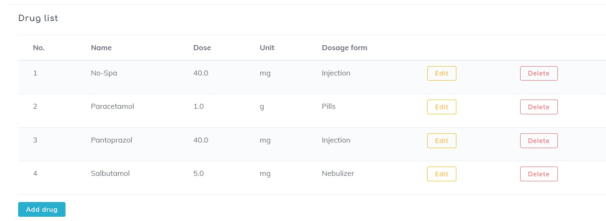
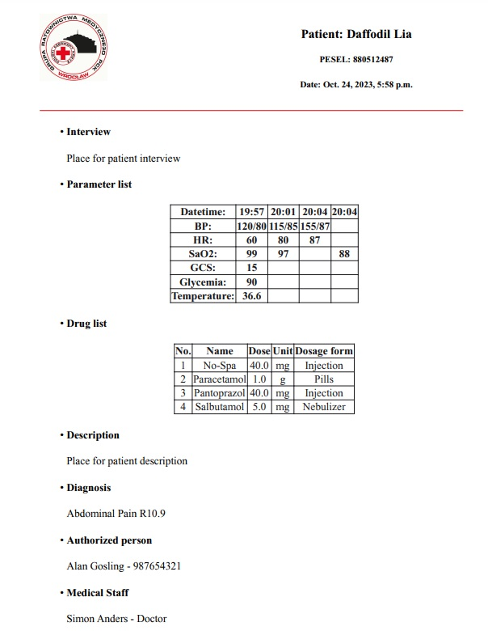
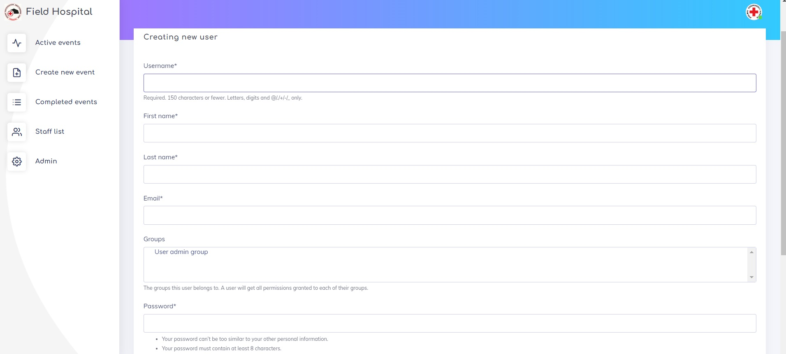
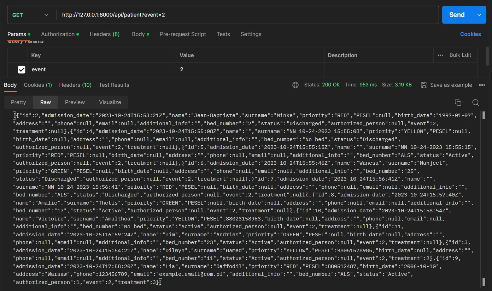

# FIELD HOSPITAL

## Table of Contents

- [Project Overview](#project-overview)
- [Technologies](#technologies)
- [Usage](#usage)
- [Features](#features)
- [Getting Started](#getting-started)
  - [Installation](#installation)
  - [Configuration](#configuration)
  - [Running the Development Server](#running-the-development-server)
  - [Run in Docker](#run-in-docker)
- [Database](#database)
- [Testing](#testing)
- [Author](#author)

## Project Overview

This project is created to manage workflow and patient flow of field hospital.
It is built using Django 4.2.3. It's made for long and short term mass events,
festivals, disasters and other activities where medical support are needed.
User can create events, manage them, add patients and create medial documentation.
All of these operations are available by API.

## Technologies

The most important technologies used in the project:

- Python 3.11
- Django 4.2.3
- PostgreSQL 16
- AWS: EB, EC2, S3, RDS
- Docker 24.0.5,
- DjangoRestFramework 3.14.0
- Nginx 1.25.3
- Pandas 2.0.3
- Plotly 5.16.1
- Pre-commit 3.3.3
- Crispy-bootstrap4 2022.1
- Weasyprint 60.1
- Factory-boy 3.3.0

## Usage

To enter into service you need to have user account. It's for safety reasons - personal information about patients,
treatment, given drugs or diagnose is restricted for medical staff.

#### Main page


Main page - list of events with status "preparing" or "in progress"

Below examples of some app screenshots.

<details>
<summary>Patient page</summary>



List of patient from event. There are two tables: of active and discharged patients.
From this side, user can close and update event, add new patient and get list of patient by email or pdf.

</details>

<details>
<summary>Patient list pdf</summary>


Example of pdf file about event with patient list.

</details>

<details>
<summary>Patient info</summary>


Detail of patient. User can check base information, update them, add auth person,
add treatment or download medical documentation.

</details>

<details>
<summary>Vital sign plot</summary>


Element of treatment: vital signs table and plot. User can choose what kind of signs want to add - it's not necessary to add all at once.

</details>

<details>
<summary>Drug table</summary>


Element of treatment: drugs admitted to patient. Medic can choose drug, unit and dosage form from list.

</details>

<details>
<summary>Medical documentation in pdf</summary>


Example of medical documentation in pdf.

</details>

<details>
<summary>Create user</summary>


Example of form - creating new user. Admin can add user to admin group.

</details>

<details>
<summary>API response</summary>


Example of api response.

</details>

## Features

- [Feature 1]: Events - active, completed. User can create, close and review all of them.
- [Feature 2]: Patients - it's possible to add patient into every active event. Patients have own triage colour to help
  making decision of priority.
- [Feature 3]: Every patient has his own treatment, authorized person, and staff person. In treatment can create medical
  documentation, where can add for example: vital signs, drugs, diagnosis.
- [Feature 4]: Staff - list of medical staff.
- [Feature 5]: Users - for administrating service.
- [Feature 6]: PDF download - events list, patient list of every event and medical documentation is available in pdf format.
- [Feature 7]: User can send email with list of patient for each event. For safety reasons it not includes details about treatment.
- [Feature 8]: API - CRUD operations on models are available via API.
- [Feature 8]: Docker - files configured for 3 containers (web app, database and staticfiles server).

## Getting Started

Follow these steps to get your project up and running locally.

### Installation

1. Clone the repository:

   ```bash
   git clone https://github.com/SzymKam/field_hospital
   cd src
   ```

2. Create a virtual environment (optional but recommended):

   ```bash
   python -m venv venv
   source venv/bin/activate  # On Windows, use `venv\Scripts\activate`
   ```

3. Install project dependencies:

   ```bash
   pip install -r requirements.txt
   ```

### Configuration

Configure your project by setting up environment variables:

- SECRET_KEY - default is randomly generated

Create local server of PostgreSQL, and set variables to connect:

- USER - database user
- PASSWORD - database user password
- HOST - database host
- NAME - database name

For reset user password via email, connect to email service:

- EMAIL_HOST_USER - user of email host
- EMAIL_HOST_PASSWORD - password to email host
- DEFAULT_FROM_EMAIL - email address to send mails

If you want to connect project with your AWS S3 bucket or RDS database project is prepared.

S3 bucket settings:

- USE_RDS - set 'True' if you want to use RDS in project
- RDS_DB_NAME - your RDS name
- RDS_USERNAME - your RDS username
- RDS_PASSWORD - your RDS password
- RDS_HOSTNAME - your RDS host

AWS S3 configuration

- USE_S3 - set 'True' if you want to use S3 for static and media files in project
- AWS_ACCESS_KEY_ID - your AWS access key id
- AWS_SECRET_ACCESS_KEY - your AWS secret access key
- AWS_STORAGE_BUCKET_NAME - your S3 bucket name

To help set local variables correctly, you can use ".env.dist" file. Copy this file as ".env" and set you variables values.

### Running the Development Server

1. Run database migrations:

   ```bash
   python manage.py migrate
   ```

2. Create a superuser (admin):

   ```bash
   python manage.py createsuperuser
   ```

3. Start the development server:

   ```bash
   python manage.py runserver
   ```

Your Django project should now be accessible at [http://localhost:8000/].

### Run in Docker

Make sure you have installed and running Docker engine. Docker, docker-compose files and nginx files are configured for
three containers: web, db and nginx server for staticfiles. To run project:

```bash
docker compose up --build
```

Your Django project should now be accessible at [http://localhost/].
Don't forget to make migrations, collect staticfiles and createsuperuser.

```bash
docker-compose  exec web python manage.py migrate
docker-compose  exec web python manage.py collectstatic
docker-compose  exec web python manage.py createsuperuser
```

## Database

Overview of the database structure and models:

- [Model 1]: Event - user can add nane, event localization, short description, start date and status - some of them are
  set by default - able to change by user. When user close event - end date is set automatically.
- [Model 2]: Patient - includes personal information about birthdate, name, contact information etc. When patient has no
  name (ex. unconscious) can be set by default. This model includes a few FK models: AuthorizedPerson, Event, Treatment.
  This model includes information necessary to hospital workflow - priority, bed number, status.
- [Model 3]: AuthorizedPerson - FK of Patient. Person to contact about patient treatment (ex. parent).
- [Model 4]: Drug - FK of Patient. Can add dose, form and unit of drug. Drug is selected from list.
- [Model 5]: MedicalStaff - FK of Treatment. The most important thing apart from the name field is medical qualifications.
- [Model 6]: VitalSign - FK of Patient. Can add blood pressure, heart rate, saturation, Glasgow Coma Scale, temperature
  and sugar level. For BP, HR and SpO2 graph of the values is drawn.
- [Model 7]: Treatment - FK of Patient. Have fields: interview, description, medical staff and diagnosis. For diagnose
  user can choose ICD10 list (International Classification of Diseases).

## Testing

To run the tests for this project, use the following command:

```bash
python manage.py test
```

For testing is used included in Django - Unit Test.
Total test coverage is 98%, with 5242 Stmts and 126 Miss.

## Author

SzymKam

https://github.com/SzymKam
