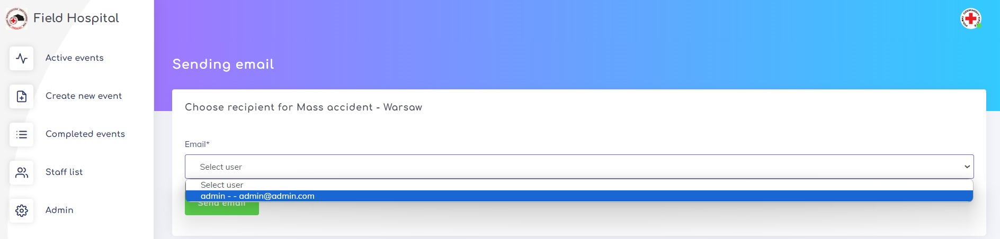

# FIELD HOSPITAL

## Table of Contents

- [Project Overview](#project-overview)
- [Technologies](#technologies)
- [Usage](#usage)
- [Features](#features)
- [Getting Started](#getting-started)
  - [Installation](#installation)
  - [Configuration](#configuration)
  - [Run in Docker](#run-in-docker)
  - [Running the Development Server](#running-the-development-server)
- [Database](#database)
- [Testing](#testing)
- [Author](#author)

## Project Overview

This project is created to manage workflow and patient flow of field hospital.
It is built using Django 4.2.3. It's made for long and short term mass events,
festivals, disasters and other activities where medical support are needed.
User can create events, manage them, add patients and create medial documentation.
All of these operations are available by API.

## Technologies

The most important technologies used in the project:

- Python 3.11
- Django 4.2.3
- PostgreSQL 16
- Docker 24.0.5,
- DjangoRestFramework 3.14.0
- Nginx 1.25.3
- Pandas 2.0.3
- Plotly 5.16.1
- Pre-commit 3.3.3
- Crispy-bootstrap4 2022.1
- Weasyprint 60.1
- Factory-boy 3.3.0

## Usage

To enter into service you need to have user account. It's for safety reasons - personal information about patients,
treatment, given drugs or diagnose is restricted for medical staff.

#### Main page

Main page - list of events with status "preparing" or "in progress"

#### Patient page

List of patient from event. There are two tables: of active and discharged patients.
From this side, user can close and update event, add new patient and get list of patient by email or pdf.

Example of pdf file about event with patient list.

Choose register user as email receiver. The same information as in PDF will be sent to the e-mail.

Detail of patient. User can check base information, update them, add auth person,
add treatment or download medical documentation.
